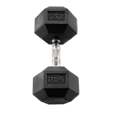
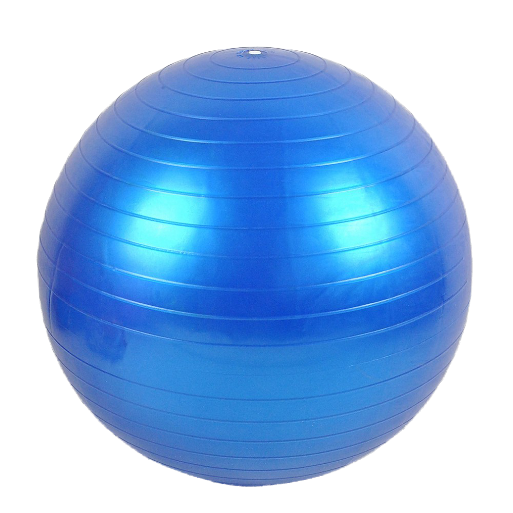
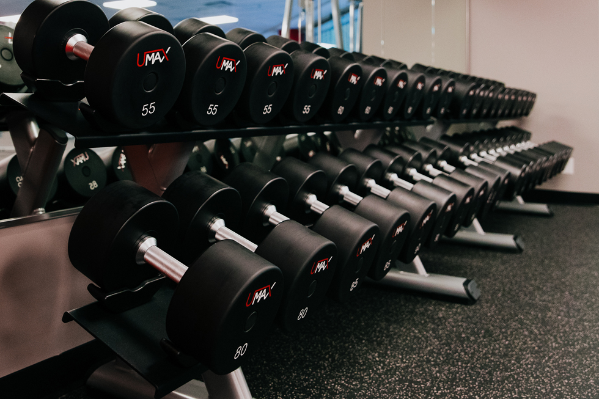
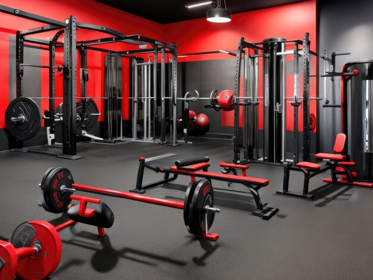
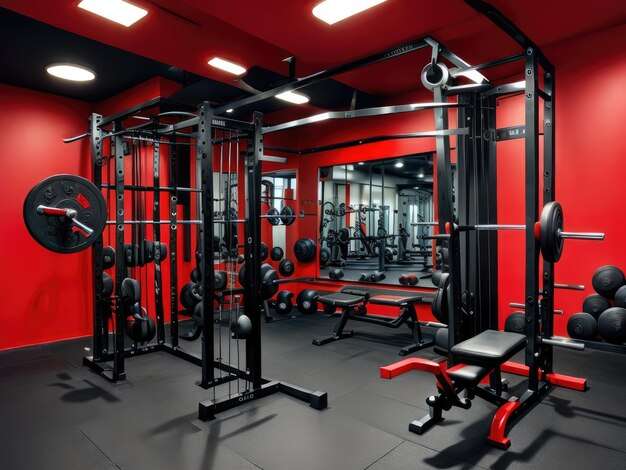

<!DOCTYPE html>
<html lang="en">
<head>
    <meta charset="UTF-8">
    <meta http-equiv="X-UA-Compatible" content="IE=edge">
    <meta name="FilPal" content="Welcom in FilPal">
    <!-- Style Link -->
    <link rel="stylesheet" href="FilPalQ.css" >
    <!-- Fontawsome -->
    <link rel="stylesheet" href="https://cdnjs.cloudflare.com/ajax/libs/font-awesome/6.5.1/css/all.min.css" integrity="sha512-DTOQO9RWCH3ppGqcWaEA1BIZOC6xxalwEsw9c2QQeAIftl+Vegovlnee1c9QX4TctnWMn13TZye+giMm8e2LwA==" crossorigin="anonymous" referrerpolicy="no-referrer" />
    <title>FilPal</title>
</head>
<body>
    <!-- Header Start-->
    <header>
     

        
        <nav>
            <ul>
                <li><a href="#home">Home</a></li>
                <li><a href="#about">About</a></li>
                <li><a href="#menu">Menu</a></li>
                <li><a href="#gallery">Gallery</a></li>
                <li><a href="#contact">Contact</a></li>
            </ul>
        </nav>
     

     

        <h1>Welcome To FilPal Gym</h1>
        
Here is the best place to build your muscles

        <a href="#" class="btn btn-primary">Book a Table</a>
     

    </header>
    <!-- Header End-->
    <main>
        <!-- About Start-->
        <section id="about">
          

            

                <h2>Our Gym</h2>
                
All you should know about our gym

            

            

                

                    
Welcome to our gym, number one in the world. Our gym has the best high-quality sports equipment. 
                        We have approximately 9,500 sports machines and tools, whether for bodybuilding or other sports.

                    
We have many sports that include (karate - taekwondo - judo - taijutsu - boxing - kickboxing...)

                    <a href="#" class="btn btn-secondary">LEARN MORE</a>
                

                
            

          

        </section>
         <!-- About End-->
         <!--Offers Start-->
          <section id="offers">
            

                

                    <h2>Our Special Offers</h2>
                    
All you should know about our gym

                

                

                    

                        
                        

                            <h3>Halteres</h3>
                            
Dumbbells are a bodybuilder's best friend. At home,  in the gym or on the go, they are easily  transportable and essential for daily sessions.

                            
<del>$40</del>$24

                        

                    

                    

                        
                        

                            <h3>Kettlebell</h3>
                            
Kettlebells are ideal weights for your WODs or to  perform your favorite bodybuilding exercises!  Vary your exercises with kettlebells

                            
<del>$134.33</del>$59

                        

                    

                    

                        
                        

                            <h3>ballon-gymnastique</h3>
                            
This gym ball (size 1) allows you to tone your body,  strengthen your back and stretch during your  sports sessions. It is designed to last!

                            
<del>$23.95</del>$16

                        

                    

                

            

          </section>
         <!--Offers End-->
         <!--Menu Start-->
          <section id="menu">
            

                

                    <h2>Our Special Menu</h2>
                    
Orther two and get third for free

                

                

                    

                        

                            
                            

                                <h3>Carpet $20.00</h3>
                                
Lightweight and practical, our versatile training mat also offers good support.

                            

                        

                        

                            
                            

                                <h3>Cross $1299.00</h3>
                                
Discover high-end training at home with our Decathlon elliptical bikes.

                            

                        

                        

                            
                            

                                <h3>Dumbbell $199.00</h3>
                                
Dumbbell allow you to target muscle gain, increased strength and explosiveness as well as higher caloric expenditure depending on the chosen exercise.

                            

                        

                    

                    

                        

                            
                            

                                <h3>weight training disc $27.00</h3>
                                
To keep your weight plates as long as possible there are a few simple tips to implement.

                            

                        

                        

                            
                            

                                <h3>Medical Balloon $1299.00</h3>
                                
We created this medicine ball so that you can perform your static or dynamic muscle strengthening exercises.

                            

                        

                        

                            
                            

                                <h3>Treadmill $299.00</h3>
                                
Get a convenient workout with our heart rate treadmills.

                            

                        

                    

                

            

          </section>
         <!--Menu End-->
<!-- Daytime Start-->
         <section id="Daytime">
            

            

         </section>
<!-- Daytime End-->
         <!-- Gallery Start -->
         <section id="gallery">
            

               <h2>Our Gallery</h2>
               

                
                
                
                
                
                
               

            

         </section>
         <!-- Gallery End-->
         <!-- Contact Start-->
         <section id="contact">
            

                

                    

                        

                            <h3>ADDRESS</h3>
                            
<i class="fa-solid fa-location-dot"></i>Mohammedia, 14 February, Morocco

                            
<i class="fa-solid fa-phone"></i> Phone: 0770248225

                            
<i class="fa-regular fa-envelope"></i>soufianeidboubker578@gmail.com

                        

                        

                            <h3>WORKING HOURS</h3>
                            
8:00 am to 11:00 pm on Weekdays

                            
9:00 am to 12:00 pm on Weekends

                        

                        

                            <h3>FOLLOW US</h3>
                            <a href="#"><i class="fa-brands fa-facebook"></i></a>
                            <a href="#"><i class="fa-brands fa-twitter"></i></a>
                            <a href="#"><i class="fa-brands fa-instagram"></i></a>
                        

                    

                    <form>
                    </form>
                

            

         </section>
         <!-- Contact End-->
    </main>
    <footer id="footer">
        
Copyright &copy; 2024 All rights reserved | Made by <b>Soufiane</b>

    </footer>
</body>
</html>
styles css 
@import url('https://fonts.googleapis.com/css2?family=Quicksand:wght@300..700&display=swap');

* {
    padding: 0;
    margin: 0;
    box-sizing: border-box;
}

html {
    scroll-behavior: smooth;
}

body {
    font-family: "Quicksand", sans-serif;
}

ul{
    list-style: none;
}

a {
    text-decoration: none;
}

.container {
    max-width: 1100px;
    margin: auto;
}

/* Utility classes */
.primary-text {
    color: #18a1f6;
}

.btn {
    display: inline-block;
    padding: 15px 30px;
    border: none;
    border-radius: 15px;
}

.btn-primary {
    color: #fff;
    border: 1px solid #fff;
}

.btn-secondary {
    color: #fff;
    background: #383848;
    margin-top: 2rem;
}

.btn-primary:hover,
.btn-secondary:hover {
    background-color: #18a1f6;
}
/* Header Start */
header {
 height: 100vh;
 background: url('HDID.jpg') center center/cover no-repeat;
 position: relative;
}

#navbar {
    display: flex;
    justify-content: space-between;
    align-items: center;
}

#navbar img {
    width: 80px;
    margin-left: 100px;
}

#navbar ul {
    display: flex;
    margin-right: 100px;
}

#navbar ul li a {
    padding: 15px 20px;
    color: white;
    font-weight: 600;
}

#navbar ul li a:hover {
    border-bottom: 2px solid #18a1f6;
}

header .content {
    display: flex;
    flex-direction: column;
    justify-content: center;
    align-items: center;
    height: 75%;
}

header .content h1 {
    font-size: 40px;
    color: #fff;
}

header .content p {
    margin: 20px 0 40px;
    color: #fff;
}

header::before {
    content: "";
    position: absolute;
    top: 0;
    left: 0;
    height: 100%;
    width: 100%;
    background: rgb(0, 0, 0, 0.5);
}

header * {
  z-index: 10;
}
/* Header End */

/* About Start */
#about {
    height: 80vh;
    display: flex;
    justify-content: center;
    align-items: center;
    background-color: #f4f4f4;
}

#about .title ,
#offers .title,
#menu .title {
    text-align: center;
    margin-bottom: 4rem;
}

#about h2,
#offers h2,
#menu h2,
#gallery h2 {
    font-size: 40px;
    margin-bottom: 20px;
}

#about h2,
#menu h2 {
    color: #383848;
}

#about .title p,
#menu.title p {
    font-size: 14px;
    color: #9a9a9a;
    font-weight: 600;
}

#about .about-content {
     display: flex;
     justify-content: space-between;
}

#about .about-content img {
     width: 450px;
}

#about .about-content p {
    color: #9a9a9a;
    margin-right: 7rem;
    font-weight: 500;
    line-height: 1.6;
}
/* About End */

/* Offers Start */
#offers {
    height: 98vh;
    display: flex;
    justify-content: center;
    background: url('whiteBg2.jpg') center center/cover fixed;
}

#offers h2 {
    color: #18a1f6;
}

#offers .title p {
    color: black;
    font-weight: 500;
}

#offers .offers-items {
    display: flex;
    justify-content: center;
    align-items: center;
    text-align: center;
    color: black;
}

#offers .offers-items img {
  width: 200px;
  margin: 0px 50px;
}

#offers .offers-items h3 {
  font-size: 25px;
  margin: 15px 0;
}

#offers .offers-items p {
  font-size: 14px;
  padding: 0 30px;
  font-weight: 300;
  margin-bottom: 15px;
}

#offers .offers-items span {
    font-size: 18px;
    font-weight: 600;
    margin-left: 5px;
}

/* Offers End */

/* Menu Start */
#menu {
    background: #f4f4f4;
    padding: 5rem 0;
}

#menu .menu-items {
    display: flex;
    justify-content: center;
    align-items: center;
}

#menu .menu-items .menu-item {
    display: flex;
    justify-content: center;
    align-items: center;
    margin: 40px;
}

#menu .menu-items .menu-item img {
    width: 80px;
    border-radius: 50%;
    margin-right: 20px;
}

#menu .menu-items .menu-item h3 {
    color: #383848;
    border-bottom: 1px dashed #c2bdbd;
    padding-bottom: 10px;
    margin-bottom: 10px;
    position: relative;
}

#menu .menu-items .menu-item span {
    position: absolute;
    top: 0;
    right: 0;
}

/* Menu End */
/* Gallery Start */

#gallery {
    background: url('MusclMan.jpg') center center/cover no-repeat;
    padding: 8rem 0 6rem;
}

#gallery h2 {
    color: #fff;
    text-align: center; 
}

#gallery .img-gallery {
    display: flex;
    justify-content: center;
    align-items: center;
    flex-wrap: wrap;
}

#gallery .img-gallery img {
    width: 280px;
    height: 200px;
    border-radius: 15px;
    margin: 20px;
    opacity: 0.8;
}

#gallery .img-gallery img:hover {
    opacity: 1;
}
/* Gallery End */

/* Contact Start */
#contact {
    padding: 5rem 0;
    background: #f4f4f4;
}

#contact .container {
    max-width: 900px;
}

#contact .contact-content {
    display: flex;
    justify-content: space-evenly;
    align-items: center;
}

#contact .contact-content .contact-info {
    width: 50%;
}

#contact .contact-content .contact-info div {
    margin: 30px 0;
    line-height: 1.7;
}

#contact .contact-content .contact-info h3 {
 font-size: 28px;
 color: #383848;
 margin-bottom: 10px;
}

#contact .contact-content .contact-info p {
 color: #9a9a9a;
}

#contact .contact-content .contact-info i {
    color: #18a1f6;
    margin-right: 5px;
}

#contact .contact-content .contact-info a i {
  color: #fff;
  background-color: #383848;
  padding: 15px;
  border-radius: 50%;
  font-size: 20px;
}

#contact .contact-content .contact-info a i:hover {
    background: #18a1f6;
    color: #383848;
}
/* Contact End */

/* Footer Start */
#footer {
    background: #383848;
    text-align: center;
    color: #fff;
    padding: 15px 0;
    font-size: 14px;
}

#footer b {
    color: #fff;
}
/* Footer Start */
